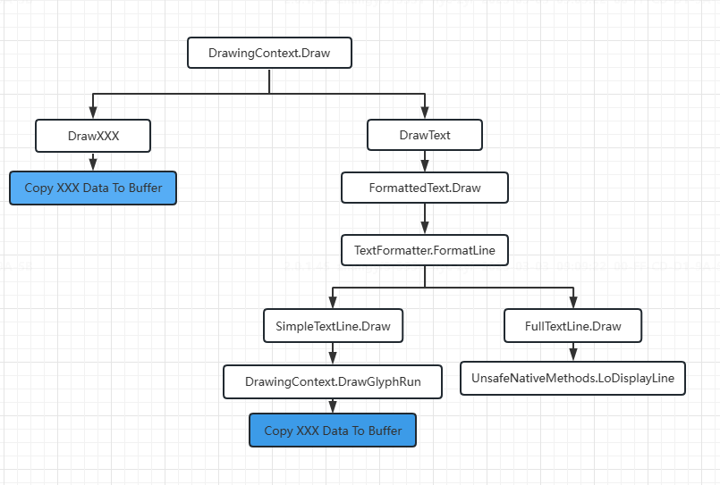

# DrawingVisual简介

DrawingVisual是一个轻量的绘图对象，之所以轻量，是因为它不提供布局或事件处理，从而可以提高性能。

通过查看WPF的源码发现，在调用DrawingContext.DrawXXX方法的时候，实际上是把要画的图形的数据拷贝到了DrawingContext自己维护的一个byte数组里。  

DrawText有点不一样，DrawText需要传进去一个FormattedText对象，DrawText内部会调用FormattedText的Draw方法，FormattedText内部使用TextFormatter来DrawText。TextFormatter是WPF的文本排版引擎，应该是属于WPF里最底层的文本控制API了。
DrawText会调用TextFormatter.FormatLine方法去创建一个TextLine，然后调用TextLine.Draw方法去渲染文本。
TextFormatter.FormatLine会创建两种TextLine，一种是SimpleTextLine，另外一种是FullTextLine。
SimpleTextLine.Draw比较简单，实际上是调用了DrawingContext.DrawGlyphRun方法，DrawGlyphRun也是把要画的数据拷贝到内存里。如果要画的文本只有一行，那么TextFormatter始终会创建SimpleTextLine。
FullTextLine就比较复杂，FullTextLine.Draw方法里调用了UnsafeNativeMethods.LoDisplayLine，这个函数是C++的，不知道它内部做了什么操作。如果文本比较复杂（多行），那么TextFormatter会创建FullTextLine。

我整理了一个DrawingContext.Draw方法的流程图：

要注意的是，DrawText方法会比较耗时，因为WPF内部会对文本进行排版操作，所以如果文本没有变化的话，最好不要每次都调用DrawText，而是用其他方式去修改DrawingVisual。

# 如何使用DrawingVisual画图

# 关于FramworkElement.OnRender方法

除了用DrawingVisual来画图，还可以通过重写FrameworkElement.OnRender方法来画图，这两者本质上是一样的，最后都是使用DrawingContext去画图。
唯一的区别就是FrameworkElement.OnRender的调用时机是WPF布局系统控制的，而DrawingVisual的画图时机是程序员自己控制的，而且DrawingVisual更轻量，速度更快，因为DrawingVisual没有参与布局逻辑和事件处理逻辑。

# 对DrawingVisual做鼠标命中测试

虽然DrawingVisual没有鼠标点击事件，但是DrawingVisual提供了鼠标命中测试的功能。

