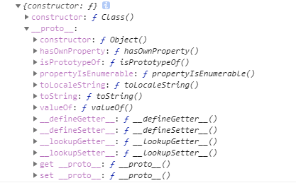
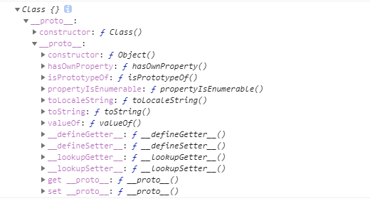

本篇文章分享下我对js里的原型链（**`prototype`**）的理解，希望对读者有帮助。<br/>
先说下原型链的作用，原型链允许子对象访问父对象里的函数，js里所有的对象都继承自Object，也就是说通过原型链模式，js里的任意对象都可以访问到Object对象里的函数。<br/>
首先从toString函数开始说起：

# 神奇的toString()
首先，定义一个没有任何属性和函数的空对象：
```js
function Class()
{

}
```
然后，创建一个实例并调用toString函数：
```js
var classInstance = new Class();
console.log(classInstance.toString());
```
神奇的事情发生了，虽然Class对象里没有任何函数，但是浏览器并没有提示错误，而且控制台显示toString竟然是个函数，这是怎么回事？toString函数是从哪里来的？要说清楚这个东西，首先要介绍下js里的两个神秘的属性：`prototype`和`__proto__`


# prototype
说明：
* prototype的所有者是对象，可以通过`Class.prototype`来访问。  
* prototype被称为**原型对象**，从字面意思理解就是指**对象的原型**
* prototype保存了两个东西：
* 对象自身的所有属性和函数
* Object对象的所有属性和函数被保存在了**`__proto__`**字段里

在浏览器里看下Class.prototype：
```js
console.log(Class.prototype);
```


可以看到Class对象里没有任何自定义属性。__proto__字段里保存了Object对象的原型。  


# \_\_proto\_\_
说明：
* \_\_proto\_\_的所有者是对象的实例
* \_\_proto_\_属性里保存的是对象的prototype的引用，用一行代码来表示prototype和\_\_proto\_\_的关系：

```js
Class.prototype === classInstance.__proto__
```
* \_\_proto\_\_存在于prototype里

在浏览器里看下classInstance：
```js
console.log(classInstance)
```


可以看到classInstance的\_\_proto\_\_字段里的内容和Class.prototype里的一致

# classInstance是如何找到toString函数的

## new操作符
文章开头使用new操作符创建了Class对象的实例：
```js
var classInstance = new Class();
```
在这个过程中，运行时分几个步骤：
* 创建一个继承自 Class.prototype 的实例。
* 使用指定的参数调用构造函数 Class，并将 this 绑定到新创建的实例上。
* 由构造函数返回的对象就是 new 表达式的结果。如果构造函数没有显式返回一个对象，则使用步骤1创建的对象。（一般情况下，构造函数不返回值，但是用户可以选择主动返回对象，来覆盖正常的对象创建步骤）

## 原型链搜索过程

当访问classInstance中的一个属性时，js运行时会先在classInstance里搜索属性，如果存在，则直接调用；如果不存在，会去搜索classInstance.\_\_proto\_\_属性，如果在\_\_proto\_\_属性里找到，则使用\_\_proto\_\_属性里的值；如果没找到，运行时会在\_\_proto\_\_属性的\_\_proto\_\_属性里继续查找，一直到找到或者不存在__proto__属性为止。运行时就像在一根链条上查找一样，所以把这样的模型称为原型链。

# 后记
其实prototype原型对象这个中文解释很形象，对象的原型，意思就是实例化之后对象是什么样子的。prototype里的数据就是实例化之后的对象里的数据，然后js在运行的时候，会通过原型链搜索这个原则去调用函数和属性，这样就不难理解了。


## 附录：原型链相关的函数
* __Object.prototype.hasOwnProperty__  
判断属性是否是对象自己定义的属性而不是原型链上的属性
