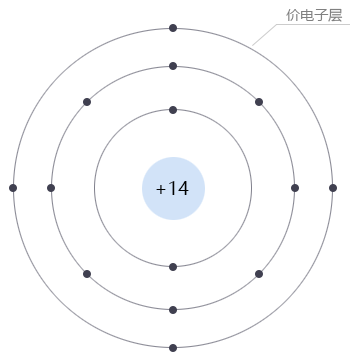
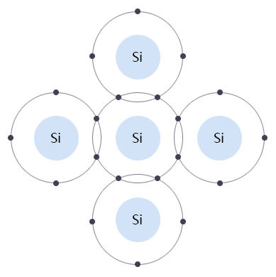
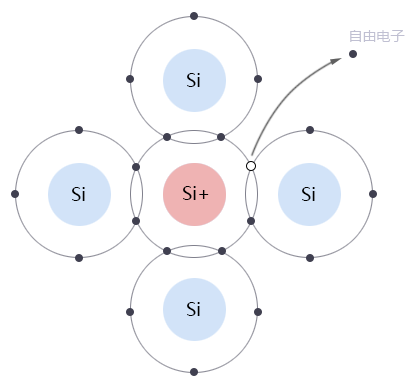
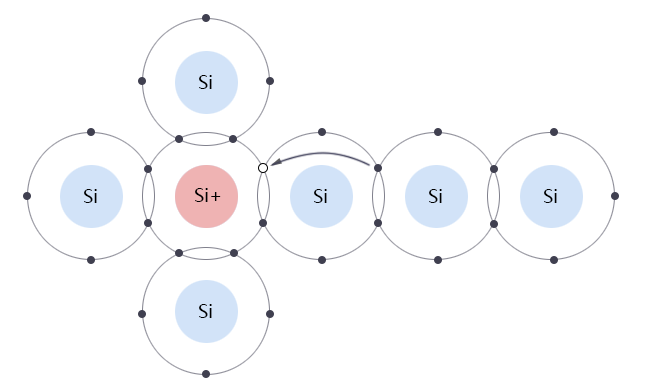
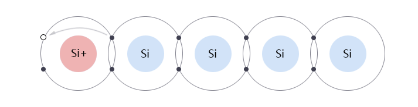

## PN结

要理解PN结首先要理解原子结构。

电子：
电子带负电，电量为1.602176634×10库仑，是电量的最小单元，质量为9.10956×10kg，常用符号e表示。

原子核：
位于原子的核心部分，由质子和中子构成。

原子：
由一个带正电的原子核和围绕它运动的若干电子组成。
原子最外层轨道上的电子成为价电子。最外层的电子层成为价电子层。

离子：
当原子失去了一个电子，那么就变成了正离子。
当原子得到了一个电子，那么就变成了负离子。

## 原子模型
在原子结构中，电子绕原子核运行的轨道是分层的（即：离散的），每一层轨道能容纳的电子数量是有限的，每层的最大电子数为：2N2。例如：最靠近原子的一层，其N=1，则这层轨道最多能容纳2*12=2个电子；第二层（N=2）轨道最多能容纳的电子数为2*22=8个；第三层轨道最多能容纳的电子数为18个，第四层32个，…… 依此类推。
当然，本层轨道能容纳的最大电子数，并不是说一定要等这层电子满了才往上一层轨道填，有很多物质，在第三层填了8个电子后（第三层理论上最多能容纳18个电子），就开始填第四层了。下图是硅的原子结构示意图：

离原子核越远的电子，其能量越高，原子核对其的束缚力越弱。最外层轨道的电子能量最高，由于它们受原子核的吸引力很小，可以跟其他原子发生电子交换或共享电子，所以最外面的电子层又称为：价电子层（valence shell），在这一层的电子称为：价电子（valence electron）。化学反应主要就发生在价电子层。
这里，被称为“价”（valence）的含义是指：衡量其层电子脱离原子核的“势能大小”。一般价电子层有几个电子，这种材料就被称为“几价原子”。例如：硅的价电子层有4个电子，硅原子就可以称为“四价原子”。
一旦电子获得了足够多的能量（主要是吸收光子或热能），电子就会挣脱原子核的束缚，成为自由电子（free electron），自由电子不受其原来所属的原子核的束缚，可以在材料中自由移动。当一种材料中存在大量的自由电子时，这种材料就是电的良导体。

## 半导体
半导体的导电能力比导体弱，与导体相比，半导体中的自由电子要少得多。常见的半导体有：硅（Si）、锗（Ge）、砷化镓（GaAs）……等等。硅的原子结构图在上面的图1-1.01中已画出。
虽然硅的最外层有4个价电子，但是由于相邻的硅原子之间会共享价电子，形成所谓的共价键（covalent bonding），如下图所示（这种格状的共价键结构称为晶格（cristal lattice））：

从图中可以看到，每个硅原子与其4个相邻的硅原子各共享一个电子，由于共享价电子同时被相邻的2个原子核束缚，使得电子与原子核之间的结合力更强。虽然如此，但是仍然会有少量电子吸收到外部的热能或光子能量，而突破共价键束缚，成为自由电子。在室温下，提纯的1cm3硅材料中大约含有1.5*1010个自由电子，虽然数量也不少，但与导体比还是小了若干个数量级。
在现实工艺中，由于硅等半导体材料的提纯比较困难，所以我们一般将杂质已经低到一个很低程度的半导体材料称为：本征（intrinsic）半导体。虽然不是100% 纯硅元素，但已经接近其本质电性特征了。

## 载流子
半导体材料与金属材料的导电特性还有一个重要的差别，就是两者的载流子（carrier）不同。金属中的载流子就是自由电子，比较简单；而半导体中的情况复杂一些，半导体中有2种载流子，分别是：带负电的自由电子 和 带正电的空穴。
为了把载流子的概念介绍清楚，这里先只分析本征半导体中的导电情况。
前面讲过，半导体的价带电子，会有一部分获得足够的能量而进入导带变为自由电子，这个自由电子已经脱离其原子核的束缚，可以在材料中自由运动。原来的硅原子因为一个电子离开了它，少了一个负电荷，因此变成了一个带正电的离子（ion），如下图所示：

这里要注意的是：虽然自由电子运动到了别处，这个硅原子变成了正离子，但就整个材料来说，还是电中性的（neutral），只是局部有正有负而已。从上图中可以看到，原来共价键的地方，就留下了一个空穴（hole），这个空穴处于价带。
在半导体中，空穴也是一种载流子，也是可以导电的。那么，空穴如何导电呢？我们来看下图：

在上图中，空穴旁边同样处于价带的的另一个价电子，虽然其没有足够的能量跃入导带，但是如果是平级地移动到这个空穴的位置还是可以的，因为空穴也处于价带，所以跳动到这里并不需要获得很大的能量。当这个价电子填入这个空穴后，它原来的位置就形成了一个新的空穴。在外部电场的作用下，如果价电子都按一个方向平级运动，看上去就好像空穴在流动一样，如下图所示：

在上面的动画中，价电子是从右往左运动的，但空穴看上去好像是从左往右移动一样，所以定义空穴的运动方向与价电子运动方向相反。
因此，在半导体中的电流是由两部分叠加而成的：分别是自由电子在导带运动形成的“电子流”，和由价电子在价带运动形成的“空穴流”，两者运动方向相反。虽然从本质上讲，空穴流也是一种电子流，但是将空穴看成是一种抽象的“正电荷”运动粒子，会比较方便我们后面对PN结进行分析。
在“本征半导体”中，自由电子和空穴总是成对产生和消失：一个价电子吸收能量变为自由电子，必相应地留下一个空穴。相应的，某些自由电子会由于失去能量，而跌落到价带，与空穴重新复合。自由电子的产生与复合总体处于一个动态平衡状态。
但即便把本征半导体中的所有载流子都加起来（自由电子和空穴），相比于导体，其总的载流子数量还是是非常少的，所以其导电能力非常差。在下一节我们将分析如何利用掺杂的方法，改善半导体的导电性能。
